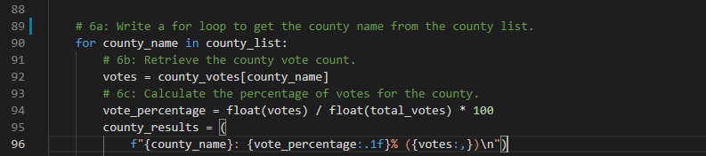
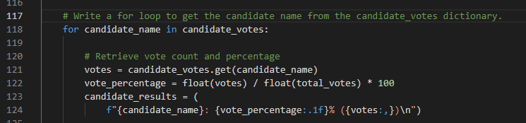

# Election_Analysis

## Project Overview
A Colorado Board of Elections employee has given you the following tasks to complete the election audit of a recent local congressional election.

1. Calculate the total number of votes cast.
2. Calculate the total number of votes and percentage of votes for each county.
3. Calculate which county had the largest number of votes.
2. Get the complete list of candidates who received votes.
3. Calculate the total number of votes each candidate won.
4. Calculate the percentage of votes each candidate won.
5. Determine the winner of the election based on popular vote.

## Resources
- Data Source: election_results.csv
- Software: Python 3.10.1, Visual Studio Code, 1.63.2

# Election-Audit Results
The analysis of the election shows that:
- There were 369,711 votes cast in the election.
- **This calculation was done with using the csv file and counting how many rows the file had. Each row was a vote, with the exception of the first row being the header.**
- The counties, their percentage of total votes, and total number of votes casted were:
    - Jefferson: 10.5% (38,855)
    - Denver: 82.8% (306,055)
    - Arapahoe: 6.7% (24,801)
- **The county results were calculated by looping through the county list to get each county. I created a "votes" variable to hold the total votes for each county and used that variable to determine the percentage of votes for each county.**

- The county which casted the most votes: Denver
- The candidates were:
    - Charles Casper Stockham
    - Diana DeGette
    - Raymon Anthony Doane
- The candidate results were:
    - Charles Casper Stockham received 23.0% of the vote and 85,213 votes.
    - Diana DeGette received 73.8% of the vote and 272,892 votes.
    - Raymon Anthony Doane received 3.1% of the vote and 11,606 votes.
- **Using the method I used to get the county results, I calculated the candidate results.**

- The winner of the election was:
    - Diana DeGette who received 73.8% of the vote and 272,892 votes.

## Election-Audit Summary
I propose that this election analysis script be used for any election with modifications to the script. There are some slight changes to be made if it were to be used. You would have to change the data source in the "file_to_load" path as well as the data source in the "file_to_save" path so that you are using the data for the specific election. You would also have to make sure that your csv file is formatted the same as the csv file used in this analysis - with ballot ID, county, and candidate as the headers for each column. 
